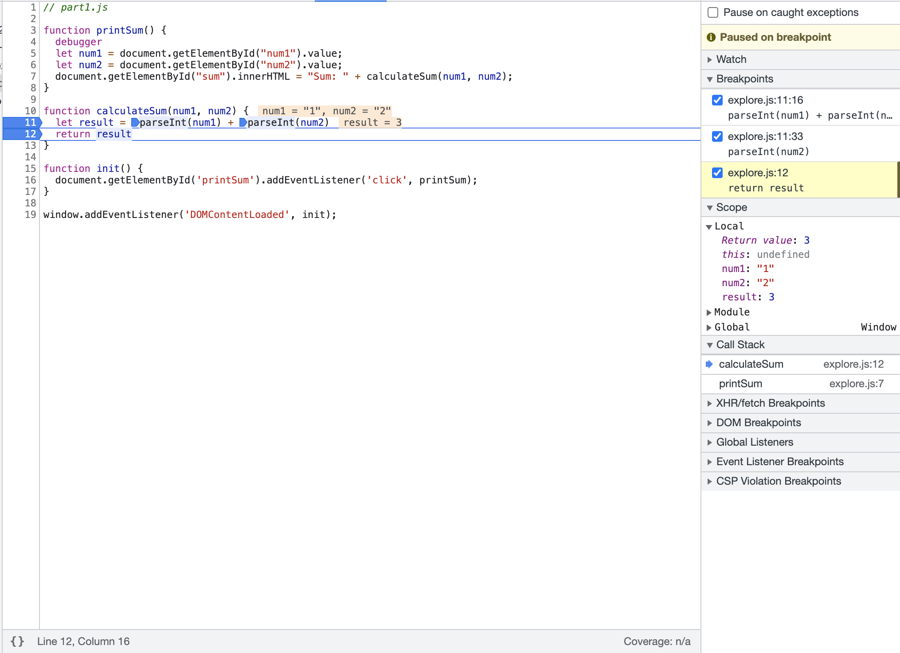

# Dev Tools Part 2

### Answers:
1. The bug was that num1 and num2 were String data types. That is why when they were added together, it added the two strings together. For example, if the user inputted 1 and 2, num1 would be '1' and num2 would be '2'. Therefore the sum would be '1' + '2', which would equal '12'.
2. To fix this code, I would have to convert the strings into numbers, and then find the sum. 